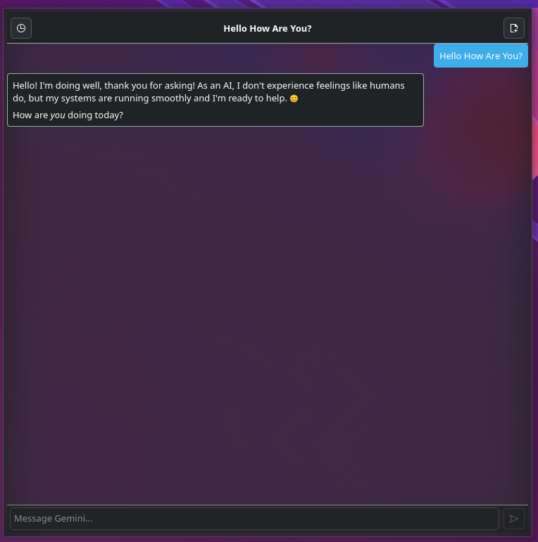
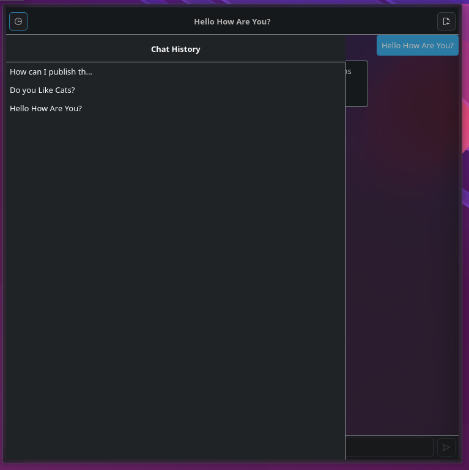

# KDE Plasma Gemini Widget

A KDE Plasma desktop widget (Plasmoid) that allows you to interact with Google Gemini AI directly from your desktop.

## Features

*   **Direct Interaction:** Chat with Gemini directly from your desktop panel or desktop.
*   **Dynamic Model Selection:** Automatically fetch and select available models associated with your API key (e.g., `gemini-1.5-flash`, `gemini-pro`).
*   **Markdown Support:** Rich text rendering for code blocks, bullet points, and bold text.
*   **Production Ready:** Includes copy-to-clipboard functionality and persistent chat history.
*   **Configurable:** Set your own API key and choose your preferred Gemini model.
*   **History:** Maintains conversation context within the current session.

## Screenshots

|                  Chat Interface                   |                 Chat History                  |                  Configuration                  |
| :-----------------------------------------------: | :-------------------------------------------: | :---------------------------------------------: |
|  |  |  |

## Installation

### Prerequisites

*   KDE Plasma 5 or 6
*   `kpackagetool5` (Plasma 5) or `kpackagetool6` (Plasma 6)

### Install

1.  Clone this repository:
    ```bash
    git clone https://github.com/mdigiacomi/kde-plasma-gemini-widget.git
    cd kde-plasma-gemini-widget
    ```

2.  Install using `kpackagetool`:
    
    **For Plasma 6:**
    ```bash
    kpackagetool6 --type Plasma/Applet --install .
    ```

    **For Plasma 5:**
    ```bash
    kpackagetool5 --type Plasma/Applet --install .
    ```

3.  **Update**: If you are updating an existing version, use `--upgrade` instead of `--install`.

### Optional: Install Icon
To use the included custom icon:
```bash
mkdir -p ~/.local/share/icons/hicolor/128x128/apps/
cp google-gemini.png ~/.local/share/icons/hicolor/128x128/apps/google-gemini.png
gtk-update-icon-cache ~/.local/share/icons/hicolor/
```

## Configuration

1.  **Get an API Key**: Visit [Google AI Studio](https://aistudio.google.com/app/apikey) to generate a free API key.
2.  **Add Widget**: Right-click on your desktop or panel -> "Add Widgets..." -> Search for "Gemini Desktop".
3.  **Configure**:
    *   Right-click the widget.
    *   Select "Configure Gemini Desktop...".
    *   Paste your API Key.
    *   (Optional) Click the "Refresh" button to fetch available models, or manually enter a model name.

## License

GPL v2+
